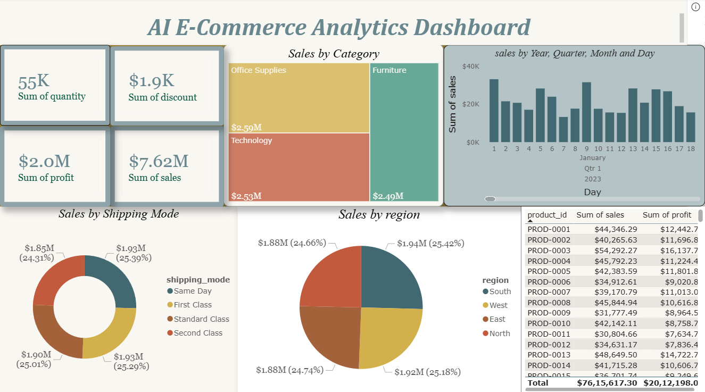
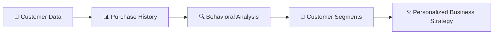
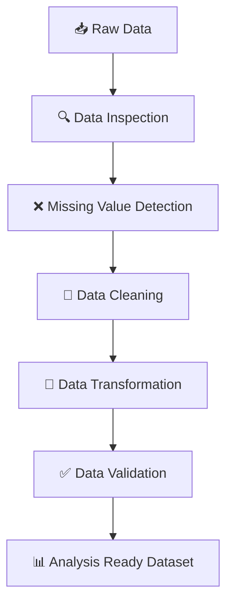

<div align="center">

# 🛒 SmartCommerce Analytics

### 🚀 AI-Powered E-Commerce Analytics & Business Intelligence Platform





<p>
Transforming raw e-commerce data into <b>actionable insights, intelligent predictions, and data-driven business decisions.</b>
</p>

<br>


<br><br>


<br>

[🚀 Getting Started](#-getting-started) •
[✨ Features](#-key-features) •
[📊 Analytics](#-analytics--insights) •
[🧠 AI & Forecasting](#-ai--predictive-analytics) •
[🛠️ Tech Stack](#️-technology-stack)

</div>

---

# 🌟 Project Overview

**SmartCommerce Analytics** is an end-to-end **AI-powered E-Commerce Analytics and Business Intelligence project** designed to transform raw business data into meaningful insights.

The project combines **data cleaning, exploratory data analysis, SQL analytics, business intelligence, dashboarding, forecasting, and AI-driven analysis** to help understand how an e-commerce business is performing.

The objective is simple:

> ## 📦 Raw Data → 🧹 Clean Data → 📊 Insights → 🧠 Predictions → 💡 Better Decisions

The analytics solution helps answer important business questions related to:

* 💰 Sales and revenue performance
* 👥 Customer behavior
* 🛍️ Product performance
* 📈 Growth trends
* 🌍 Regional or category-level performance
* 🔮 Future sales forecasting
* 🧠 AI-driven insights
* 🎯 Business decision-making

---

# 🎯 Problem Statement

E-commerce businesses generate large volumes of transactional and customer data every day.

However, raw data alone does not answer questions such as:

> 💰 Which products generate the most revenue?

> 👥 Who are the most valuable customers?

> 📈 How is the business performing over time?

> 🛒 What purchasing patterns exist?

> 🔮 What could future sales look like?

> 🎯 Where should the business focus its strategy?

**SmartCommerce Analytics** addresses this challenge by building a structured analytics workflow that converts raw e-commerce data into clear, interactive, and actionable insights.

---

# 🔄 End-to-End Workflow

```mermaid
flowchart LR

A[📂 Raw E-Commerce Data]
--> B[🧹 Data Cleaning]

B
--> C[🔍 Exploratory Data Analysis]

C
--> D[🗄️ SQL Analysis]

D
--> E[📊 Business Intelligence]

E
--> F[🧠 AI & Predictive Analytics]

F
--> G[📈 Interactive Dashboard]

G
--> H[💡 Business Insights]

style A fill:#E8F1FF
style B fill:#DFF7E3
style C fill:#FFF4CC
style D fill:#F3E8FF
style E fill:#FFE8E8
style F fill:#E6F7FF
style G fill:#FFF4CC
style H fill:#DFF7E3
```



---

# 🏗️ Project Architecture

```text
                           ┌─────────────────────────┐
                           │   E-COMMERCE DATASETS   │
                           │                         │
                           │ Orders • Customers      │
                           │ Products • Sales        │
                           └────────────┬────────────┘
                                        │
                                        ▼
                           ┌─────────────────────────┐
                           │     DATA PREPARATION    │
                           │                         │
                           │ Python • Pandas         │
                           │ Cleaning • Validation   │
                           └────────────┬────────────┘
                                        │
                         ┌──────────────┴──────────────┐
                         ▼                             ▼
              ┌──────────────────┐          ┌──────────────────┐
              │   SQL ANALYTICS  │          │   DATA ANALYSIS  │
              │                  │          │                  │
              │ Queries          │          │ EDA              │
              │ Aggregations     │          │ Trends           │
              │ Business Metrics │          │ Patterns         │
              └────────┬─────────┘          └────────┬─────────┘
                       │                             │
                       └──────────────┬──────────────┘
                                      ▼
                           ┌─────────────────────────┐
                           │ BUSINESS INTELLIGENCE   │
                           │                         │
                           │ Power BI • DAX • KPIs   │
                           └────────────┬────────────┘
                                        │
                                        ▼
                           ┌─────────────────────────┐
                           │   AI & PREDICTION       │
                           │                         │
                           │ Forecasting • Insights  │
                           └────────────┬────────────┘
                                        │
                                        ▼
                           ┌─────────────────────────┐
                           │ SMART BUSINESS INSIGHTS │
                           └─────────────────────────┘
```

---

# ✨ Key Features

<table>
<tr>
<td width="50%">

### 🧹 Data Processing

Raw data is cleaned, structured, and prepared for analysis.

</td>
<td width="50%">

### 🔍 Exploratory Analysis

Patterns, trends, distributions, and anomalies are explored.

</td>
</tr>

<tr>
<td>

### 🗄️ SQL Analytics

Business questions are answered using structured SQL queries.

</td>
<td>

### 📊 Interactive Dashboard

Business performance is visualized using Power BI.

</td>
</tr>

<tr>
<td>

### 📐 DAX Measures

Dynamic KPIs and calculated metrics support deeper analysis.

</td>
<td>

### 🔮 Predictive Analytics

Historical patterns are used to explore future business performance.

</td>
</tr>

<tr>
<td>

### 👥 Customer Analytics

Customer purchasing behavior and value can be analyzed.

</td>
<td>

### 🧠 AI-Powered Insights

Analytics is enhanced with intelligent and predictive capabilities.

</td>
</tr>
</table>

---

# 📊 Analytics & Insights

The project provides analysis across multiple business dimensions.

## 💰 Sales & Revenue Analytics

Analyze:

* Total sales performance
* Revenue trends
* Growth patterns
* High-performing periods
* Sales fluctuations
* Business performance over time

```text
Revenue
   │
   ├── 📈 Monthly Trends
   ├── 📊 Sales Performance
   ├── 🛍️ Product Contribution
   └── 🌍 Regional Insights
```

---

## 🛍️ Product Analytics

Understand product performance through metrics such as:

* Best-performing products
* Low-performing products
* Product contribution to sales
* Category performance
* Revenue distribution

```text
                PRODUCT PERFORMANCE

High Revenue   ████████████████████
Medium Revenue ██████████████
Low Revenue    ██████
```

---

## 👥 Customer Analytics

Customer analysis helps identify purchasing patterns and customer value.

Potential insights include:

* Customer activity
* Repeat purchasing behavior
* High-value customers
* Customer segmentation
* Purchase frequency
* Revenue contribution

### Customer Analytics Flow



---

# 🔮 AI & Predictive Analytics

Historical business data can be used to identify patterns and support future planning.

```text
Historical Data
       │
       ▼
Pattern Detection
       │
       ▼
Trend Analysis
       │
       ▼
Predictive Model
       │
       ▼
Future Estimates
       │
       ▼
Business Decisions
```

### Predictive capabilities can support:

* 📈 Sales forecasting
* 🔮 Future trend estimation
* 🎯 Demand analysis
* ⚠️ Pattern or anomaly detection
* 💡 Intelligent business recommendations

---

# 📊 Business Intelligence Dashboard

The Power BI dashboard provides an interactive view of e-commerce performance.

Users can explore data using:

* 🎛️ Dynamic filters
* 📅 Date-based analysis
* 🛍️ Product comparisons
* 👥 Customer insights
* 📈 Trend visualizations
* 📊 KPI cards
* 🔄 Cross-filtering
* 🔍 Interactive exploration

### Dashboard Experience

```text
                    🎛️ FILTER DATA
                          │
                          ▼
┌──────────────────────────────────────────────────┐
│                  SMARTCOMMERCE                    │
│                  ANALYTICS HUB                    │
├──────────────────────────────────────────────────┤
│                                                  │
│   💰 Revenue        📦 Orders        👥 Customers │
│                                                  │
│   📈 Trends         🛍️ Products      🎯 Insights  │
│                                                  │
└──────────────────────────────────────────────────┘
                          │
                          ▼
                   💡 TAKE ACTION
```

---

# 🎯 Key Performance Indicators

The dashboard and analysis focus on important business metrics.

| KPI                    | Description                           |
| ---------------------- | ------------------------------------- |
| 💰 Revenue             | Total business revenue generated      |
| 🛒 Orders              | Total number of transactions          |
| 👥 Customers           | Number of unique customers            |
| 📦 Product Performance | Contribution of products to sales     |
| 📈 Growth              | Performance changes over time         |
| 🔁 Customer Activity   | Customer purchasing behavior          |
| 🎯 Sales Trends        | Historical sales patterns             |
| 🔮 Forecast            | Estimated future business performance |

---

# 🧹 Data Processing Pipeline

The raw data goes through a structured preparation process before analysis.



### Key activities include:

* Checking missing values
* Identifying duplicates
* Standardizing data formats
* Handling inconsistent records
* Transforming columns
* Preparing analytical datasets
* Validating data before visualization

---

# 🗄️ SQL Analytics

SQL is used to explore and answer important business questions.

### Example analysis areas:

```sql
-- Revenue Analysis
SELECT
    category,
    SUM(revenue) AS total_revenue
FROM sales
GROUP BY category
ORDER BY total_revenue DESC;
```

### SQL concepts demonstrated

```text
SELECT          ████████████████████
WHERE           ████████████████████
GROUP BY        ████████████████████
ORDER BY        ████████████████████
JOIN            ███████████████████
CTEs            ██████████████████
Window Functions████████████████
Aggregations    ████████████████████
```

---

# 🐍 Python Analytics

Python is used for data analysis and exploration.

### Core analytics workflow

```python
# 1️⃣ Load Data
import pandas as pd

# 2️⃣ Inspect Data
df.head()

# 3️⃣ Check Missing Values
df.isnull().sum()

# 4️⃣ Explore Patterns
df.describe()

# 5️⃣ Generate Insights
```

### Typical analysis libraries

* `pandas`
* `numpy`
* `matplotlib`
* `seaborn`

Depending on the predictive workflow, machine learning tools may also be used for model development and forecasting.

---

# 📐 Power BI & DAX

Power BI transforms the processed data into an interactive analytics experience.

### Core components

```text
DATA MODEL
    │
    ├── Fact Tables
    │
    └── Dimension Tables
            │
            ▼
        RELATIONSHIPS
            │
            ▼
        DAX MEASURES
            │
            ▼
      INTERACTIVE DASHBOARD
```

DAX enables the creation of:

* Dynamic KPIs
* Aggregated measures
* Growth calculations
* Trend metrics
* Performance comparisons
* Filter-aware calculations

---

# 🛠️ Technology Stack

<div align="center">

| Technology                  | Role                                      |
| --------------------------- | ----------------------------------------- |
| 🐍 **Python**               | Data cleaning, processing, and analysis   |
| 🐼 **Pandas / NumPy**       | Data manipulation                         |
| 📊 **Matplotlib / Seaborn** | Data visualization                        |
| 🗄️ **SQL**                 | Database and business analysis            |
| ⚡ **Power BI**              | Interactive dashboards                    |
| 📐 **DAX**                  | Analytical calculations and KPIs          |
| 🧹 **Power Query**          | Data transformation                       |
| 🧠 **AI / ML**              | Intelligent and predictive analytics      |
| 📝 **Jupyter Notebook**     | Exploratory analysis                      |
| 🐙 **GitHub**               | Version control and project documentation |

</div>

---

# 📂 Suggested Project Structure

```text
SmartCommerce-Analytics/
│
├── 📂 data/
│   ├── raw/
│   └── processed/
│
├── 🐍 notebooks/
│   ├── data_cleaning.ipynb
│   └── exploratory_analysis.ipynb
│
├── 🗄️ sql/
│   └── business_analysis.sql
│
├── 📊 dashboard/
│   └── SmartCommerce_Dashboard.pbix
│
├── 🧠 models/
│   └── forecasting_model/
│
├── 📸 assets/
│   ├── dashboard-overview.png
│   ├── sales-analysis.png
│   └── customer-insights.png
│
└── 📖 README.md
```

> **Note:** Adjust the structure above to exactly match the files and folders currently present in your repository.

---

# 📸 Dashboard Preview

Add your actual dashboard screenshots here to make the repository much more visually impressive.

```markdown
<p align="center">
  
</p>
```

### Suggested sections to showcase

| Screenshot            | Purpose                                |
| --------------------- | -------------------------------------- |
| 📊 Executive Overview | High-level business KPIs               |
| 💰 Sales Analysis     | Revenue and order trends               |
| 🛍️ Product Analysis  | Product/category performance           |
| 👥 Customer Insights  | Customer behavior and segmentation     |
| 🔮 Forecasting        | Predictive analytics and future trends |

---

# 🚀 Getting Started

## 1️⃣ Clone the Repository

```bash
git clone https://github.com/chittoralovesh/SmartCommerce-Analytics.git
```

## 2️⃣ Navigate to the Project

```bash
cd SmartCommerce-Analytics
```

## 3️⃣ Install Required Python Libraries

```bash
pip install pandas numpy matplotlib seaborn jupyter
```

If a `requirements.txt` file is available:

```bash
pip install -r requirements.txt
```

## 4️⃣ Run the Analysis

Open Jupyter Notebook:

```bash
jupyter notebook
```

Then run the notebooks in the appropriate order:

```text
Data Cleaning
      ↓
Exploratory Analysis
      ↓
Business Analysis
      ↓
Predictive Analytics
```

## 5️⃣ Open the Power BI Dashboard

Open the `.pbix` file using **Microsoft Power BI Desktop**.

If prompted, update the data source path and refresh the dataset.

---

# 💡 Business Value

SmartCommerce Analytics can help stakeholders make better decisions in areas such as:

### 📦 Inventory & Product Strategy

Identify products with strong or weak performance.

### 💰 Revenue Growth

Monitor sales trends and identify growth opportunities.

### 👥 Customer Strategy

Understand purchasing behavior and customer value.

### 🎯 Marketing Decisions

Use customer and product insights to support targeted strategies.

### 🔮 Business Planning

Use historical patterns and predictions to support future planning.

---

# 🧠 Skills Demonstrated

```text
Python Data Analysis       ████████████████████
SQL Analytics              ████████████████████
Business Intelligence      ████████████████████
Power BI                   ████████████████████
Data Cleaning              ███████████████████░
Exploratory Data Analysis  ████████████████████
Data Visualization         ████████████████████
DAX                        ██████████████████░
Predictive Analytics       █████████████████░░
AI / Machine Learning      █████████████████░░
Business Analytics         ████████████████████
```

---

# 🔮 Future Enhancements

* [ ] 🤖 Advanced AI recommendations
* [ ] 🔮 Improved forecasting models
* [ ] 👥 Advanced customer segmentation
* [ ] ⚠️ Automated anomaly detection
* [ ] 🌐 Web-based analytics dashboard
* [ ] 🔄 Automated data refresh
* [ ] ☁️ Cloud deployment
* [ ] 📱 Mobile-friendly analytics
* [ ] 💬 Natural language data querying
* [ ] 🎯 Personalized product recommendations

---

# 🎓 What This Project Demonstrates

```text
┌─────────────────────────────────────────────┐
│                                             │
│          END-TO-END DATA ANALYTICS          │
│                                             │
│  📂 Data Collection                         │
│         ↓                                   │
│  🧹 Data Cleaning                           │
│         ↓                                   │
│  🔍 Exploratory Analysis                    │
│         ↓                                   │
│  🗄️ SQL Business Analysis                   │
│         ↓                                   │
│  📊 Power BI Dashboard                      │
│         ↓                                   │
│  🧠 AI & Predictive Analytics               │
│         ↓                                   │
│  💡 Actionable Business Insights            │
│                                             │
└─────────────────────────────────────────────┘
```

This project demonstrates the complete journey from **raw e-commerce data to intelligent business insights**.

---

# 👨‍💻 Author

<div align="center">

## Lovesh Chittora
<br>

<a href="https://github.com/chittoralovesh">

</a>

<a href="https://www.linkedin.com/in/lovesh-chittora/">

</a>

</div>

---

# ⭐ Support

If you found this project interesting:

<div align="center">

### ⭐ Star the repository

### 🍴 Fork it

### 💬 Share your feedback

<br>


</div>

---

<div align="center">

# 🚀 Smart Data. Smarter Decisions.

### **Collect → Clean → Analyze → Visualize → Predict → Grow**

<br>


<br><br>

**© 2026 Lovesh Chittora**

</div>
